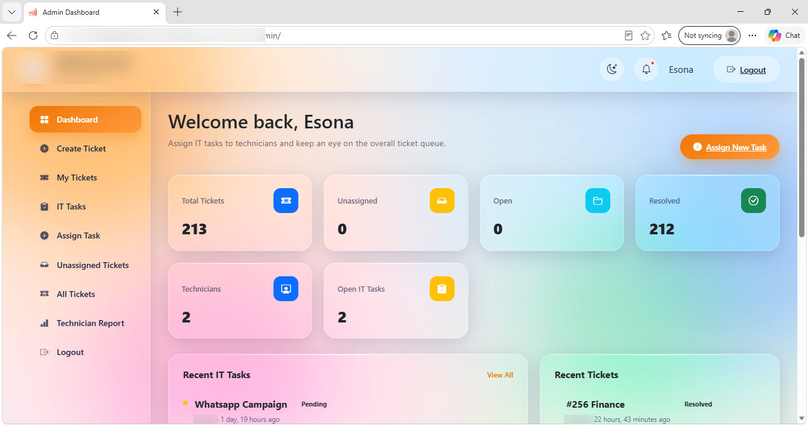
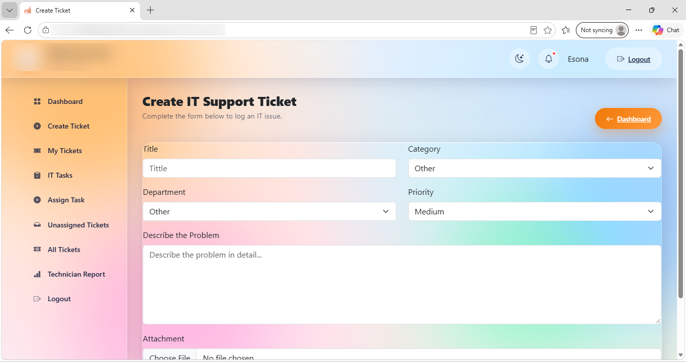
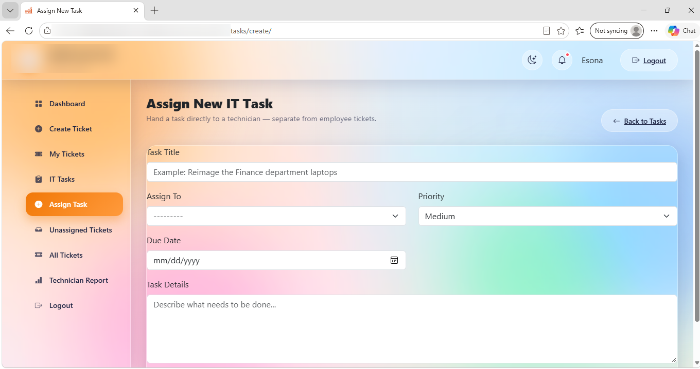
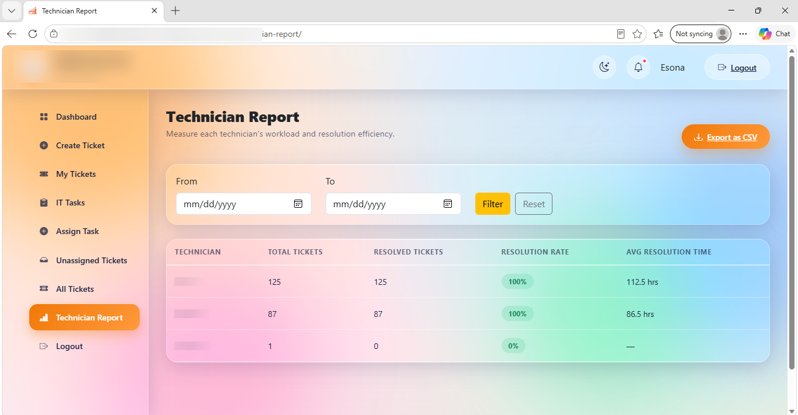
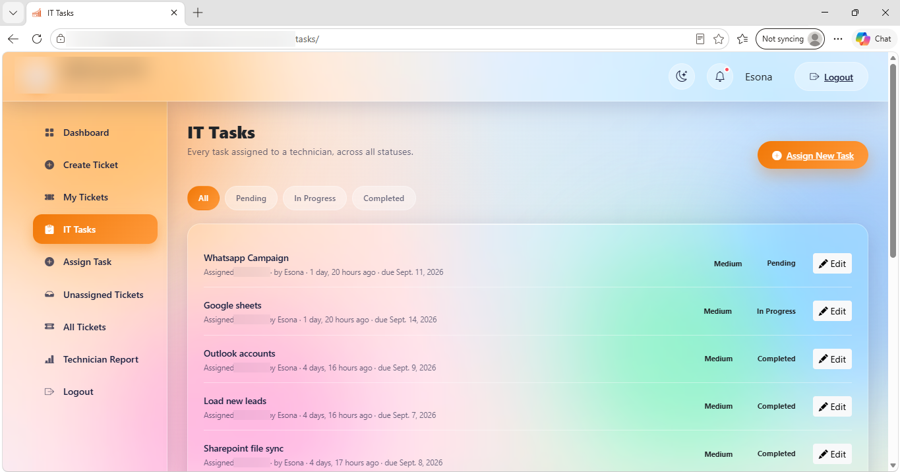
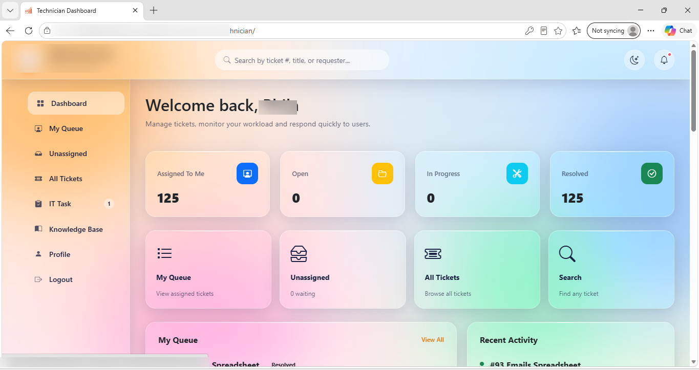
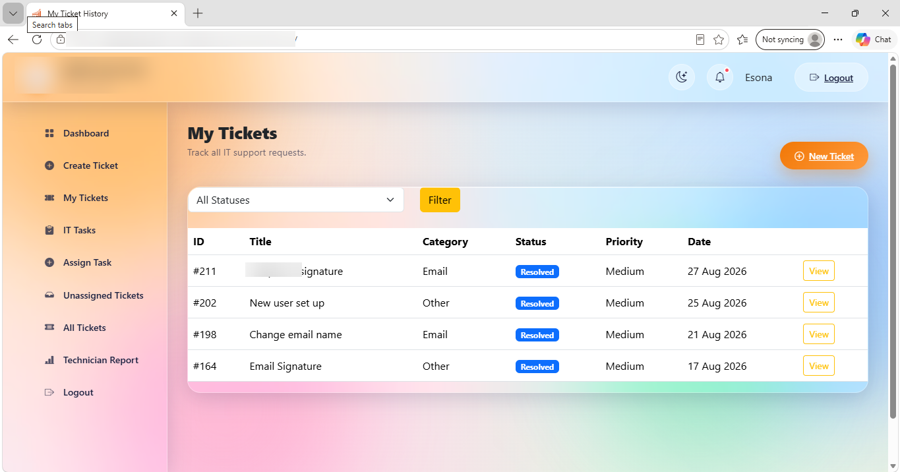
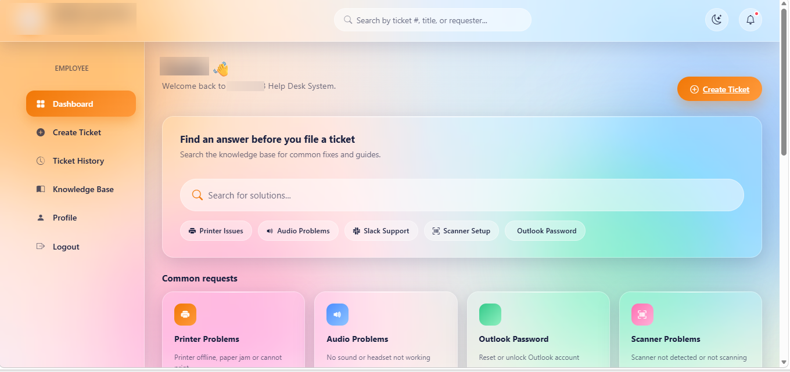

# IT Help Desk System

A full-stack IT Help Desk web application developed using **Python and Django**. The system provides separate role-based dashboards for **Employees, Technicians, and Administrators**, allowing IT support requests to be logged, assigned, tracked, resolved, and reported from one central system.

The project demonstrates practical experience in full-stack web development, authentication and authorization, database management, workflow automation, reporting, and user interface development.

> 🔒 Screenshots and identifying information such as company branding, deployment details, and staff information have been hidden or blurred for confidentiality.

---

## ✨ Key Features

### Employee Dashboard

Employees can:

- Search the knowledge base before submitting a support request
- Access quick solutions for common IT problems
- Create IT support tickets
- Select ticket category, department, and priority
- Add descriptions and file attachments
- Track previously submitted tickets
- Filter tickets by status
- Provide feedback on resolved tickets
- Receive in-app notifications when tickets are updated

### Technician Dashboard

Technicians can:

- View tickets assigned to them
- Track open, in-progress, and resolved tickets
- Access their personal ticket queue
- View unassigned tickets
- Search for tickets using ticket number, title, or requester
- Receive IT tasks assigned by an administrator
- Access the knowledge base
- Manage their profile

### Admin Dashboard

Administrators can:

- View an overview of all IT support activities
- Monitor total, open, unassigned, and resolved tickets
- View active technicians and outstanding IT tasks
- Assign tickets to technicians
- Assign standalone IT tasks
- Monitor the complete ticket lifecycle

Ticket statuses include:

`Open → Assigned → In Progress → Pending → Resolved`

Administrators can also:

- Search and filter all tickets
- Monitor technician performance
- View resolution rates
- View average ticket resolution times
- Filter reports by date
- Export ticket and technician reports to CSV

### System-Wide Features

- Secure user authentication
- Role-based access control
- Employee, Technician, and Admin user roles
- Knowledge base functionality
- Ticket notifications
- File attachments
- Ticket feedback and ratings
- Search and filtering
- Reporting and analytics
- CSV exports
- Dark and light mode
- Responsive user interface

---

## 🖼️ System Screenshots

### Admin Dashboard

| Dashboard Overview | Create Ticket |
|---|---|
|  |  |

| Assign New Task | Technician Report |
|---|---|
|  |  |

| IT Tasks |
|---|
|  |

### Technician Dashboard

| Dashboard Overview | My Tickets / Queue |
|---|---|
|  |  |

### Employee Dashboard

| Dashboard & Knowledge Base |
|---|
|  |

---

## 🛠️ Technologies Used

| Layer | Technology |
|---|---|
| Backend | Python, Django 6.0 |
| Database | PostgreSQL / SQLite |
| Authentication | Django custom user model with role-based access |
| Frontend | HTML, CSS, JavaScript, Django Templates |
| Static Files | WhiteNoise |
| Server | Gunicorn / Waitress |
| Image Handling | Pillow |
| Spreadsheet Support | openpyxl |
| Deployment | Render |

---

## 🧱 Project Structure

```text
HelpDeskSystem/
├── accounts/
│   └── Custom user model and role-based authentication
├── tickets/
│   ├── models.py
│   ├── views.py
│   └── templatetags/
├── dashboard/
│   └── Admin dashboard functionality
├── templates/
│   └── Application HTML templates
├── static/
│   └── CSS, JavaScript and images
├── screenshots/
│   └── Project screenshots
├── HelpDeskSystem/
│   └── Django settings, URLs and server configuration
├── requirements.txt
├── build.sh
└── manage.py
```

---

## 📊 Main Data Models

### CustomUser

Extends Django's user model and provides role-based access for:

- Employee
- Technician
- Administrator

### Ticket

Stores information about IT support requests, including:

- Title
- Description
- Category
- Department
- Priority
- Status
- Attachment
- Date and time
- Assigned technician
- User feedback and rating

### ITTask

Stores standalone IT tasks that administrators can assign directly to technicians.

### Asset

Stores information about hardware or equipment associated with users.

### Notification

Provides in-app notifications when important ticket or system events occur.

### KnowledgeBaseArticle

Stores self-service IT support articles that employees can search before submitting a ticket.

---

## 🚀 Running the Project Locally

### 1. Clone the repository

```bash
git clone https://github.com/Esonasipho03/HelpDeskSystemm.git
cd HelpDeskSystemm
```

### 2. Create a virtual environment

```bash
python -m venv venv
```

### 3. Activate the virtual environment

**Windows**

```bash
venv\Scripts\activate
```

**Linux/macOS**

```bash
source venv/bin/activate
```

### 4. Install the required packages

```bash
pip install -r requirements.txt
```

### 5. Configure environment variables

Configure the required environment variables, including:

```text
SECRET_KEY
DATABASE_URL
```

Do not commit passwords, secret keys, database credentials, or `.env` files to GitHub.

### 6. Run database migrations

```bash
python manage.py migrate
```

### 7. Create an administrator account

```bash
python manage.py createsuperuser
```

### 8. Start the application

```bash
python manage.py runserver
```

Then open the local development address displayed by Django in your browser.

---

## 🎯 Skills Demonstrated

- Python and Django development
- PostgreSQL and database design
- HTML, CSS and JavaScript
- Full-stack web development
- User authentication and role-based access control
- CRUD operations
- IT ticket and task management
- Reporting and analytics
- CSV data exports
- File handling
- Application deployment
- Software testing and troubleshooting
- Git and GitHub

---

## 💡 Project Purpose

The IT Help Desk System was developed to demonstrate the design and implementation of a practical IT support management solution.

The system brings together ticket management, technician task assignment, user roles, reporting, notifications, and self-service support functionality in one application.

It also demonstrates my ability to design and develop a complete web application from the database and backend logic through to the user interface.

---

## 👩‍💻 Developer

**Esonasipho Faith Mjuqu**

Software Developer | IT Technician

**GitHub:** [Esonasipho03](https://github.com/Esonasipho03)

**Project Repository:** [HelpDeskSystemm](https://github.com/Esonasipho03/HelpDeskSystemm)
